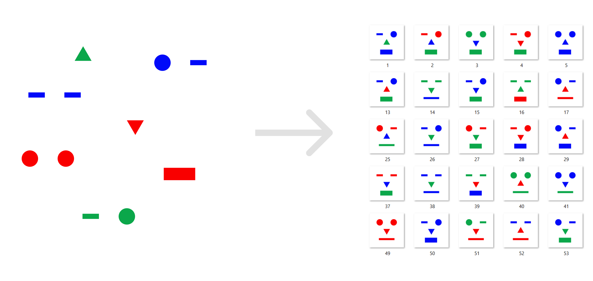
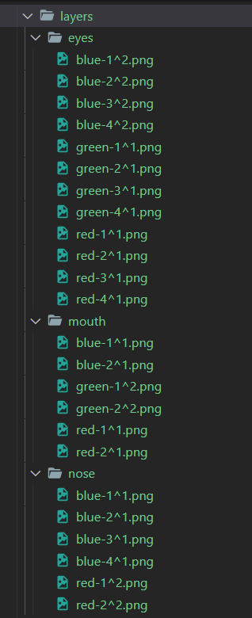

A tool for generating random unique artworks for NFT based projects

## Installation🔌

You can download the source code from [here](https://github.com/Theshawa/artwork-generator/archive/refs/heads/main.zip). If you have git installed in your computer, open your terminal and try this command.

```bash
git clone https://github.com/Theshawa/artwork-generator.git
```
---

## Usage 📑

From here consider `./bin` directory as the root directory. No need to visit anywhere outside `./bin` directory to continue.

**Windows**
Directly open `artwork-generator.exe` and continue.

**Mac**
Open your terminal from  `./bin` directory. Type this command and hit enter.

```Bash
chmod +x artwork-generator
```

Then open `artwork-generator` and continue.

---

## Configuration 🔧

There are two main things you have to concern when using this tool, and these are `layers` directory and `config.json` file.


### Layers Directory

Layers are building blocks of the artworks. Each layer must have one or more elements. Program will choose a random element from each layer and combines them to generate unique artworks.

You must include layers and elements inside `layers` directory like below, so program can identify them.
Elements must be in **.png** format.



Notice that evelry element is named according to a format like this.

```bash
[name][delimitter][weight].png
```

Here is the explanation.

- `name` : Name of the element. This can be any text which not including the *delimitter*. I recommend you to use a simple and meaningful one.
- `weight` (number): This is a positive number which defines the priority of element when generating artworks. Think this as a percentage.(You can add any number relative to the other elements, even thousands)
- `delimitter` : A symbol that helps program to identify the name and weight of element.


### config.json File

This is the main configuration file of this program. You can change the behaviour of program by adjusting values of fields in this file.

1. `layers_directory` : path of where your layers and elements live
2. `output_directory` : generated artworks will be placed here in **.png** format
3. `debugging` (true/false): to enable or disable dubugging mode
4. `delimitter` : symbol for *delimitter* explained earlier
5. `artwork` : configuration for geneartive artworks
    - `prefix` : prefix value for name of generating artworks (eg: art-1.png, here 'art' is the prefix)
    - `width` (number) : width of artwork 
    - `height` (number)
    - `compression_level`(number[0-3]) : compression level of the artwork. You must add one from below.
  
        | Value        | Meaning           
        | ------------- |-------------| 
        | 0      | best speed of generation
        | 1      | No compression   
        | 2 |  default compression     
        | 3 |  best compression (slow generation)   
    - `background` : background of the artwork. Keep this field empty for a transparency background.
6. `gif` : configuration for gif artworks.
    - `export` (true/false) : enable or disable gif export
    - `repeat` (number) : repeat value of the gif artwork. 0 means infinite repeat.
    - `delay` (number) : delay of gif. default is 50.
7. `metadata` : *NFT* metadata for each generative artwork. 
    - `export` (true/false) : enable or disable metadata export
    Only the common fields are here, others will be generated automatically.
    Visit [https://docs.opensea.io/docs/metadata-standards](https://docs.opensea.io/docs/metadata-standards) and [https://docs.metaplex.com/programs/token-metadata/token-standard](https://docs.metaplex.com/programs/token-metadata/token-standard) for the reference.
8.  `layers` : add the layer configuration here.    **Order matters**.
    Each layer has these fields.
    - `name` : name of the layer
    - `opacity` (number[0-1]) : Value between 0 and 1 which decides the opacity of layer
    - `bypass_dna` (true/false) : to by pass the dna uniqueness test

This is the complete configuration with default values.

```JSON
{
  "layers_directory": "layers",
  "output_directory": "out",
  "debugging": true,
  "delimitter": "^",
  "artwork": {
    "prefix": "",
    "width": 512,
    "height": 512,
    "compression_level": 0,
    "background": ""
  },
  "gif": {
    "export": false,
    "repeat": 0,
    "delay": 50
  },
  "metadata": {
    "export": true,
    "network": "sol",
    "description": "Friendly OpenSea Creature that enjoys long swims in the ocean.",
    "base_url": "https://storage.googleapis.com/opensea-prod.appspot.com/puffs",
    "background_color": "#000000",
    "youtube_url": "--your-youtube-url--",
    "solana": {
      "symbol": "YC",
      "seller_fee_basis_points": 1000,
      "external_url": "https://theshawa.cf",
      "creators": [
        {
          "address": "xEtQ9Fpv62qdc1GYfpNReMasVTe9YW5bHJwfVKqo72u",
          "share": 100
        }
      ]
    }
  },
  "layers": [
    {
      "name": "eyes",
      "opacity": 1,
      "bypass_dna": false
    },
    {
      "name": "mouth",
      "opacity": 1,
      "bypass_dna": false
    },
    {
      "name": "nose",
      "opacity": 1,
      "bypass_dna": false
    }
  ]
}


```


---

# Finally 😁

If you found any bugs please notice me.
My Email : [mrclocktd@gmail.com](mailto:mrclocktd@gmail.com)


Visit [https://theshawa.cf](https://theshawa.cf) to see more.

Thank you. 
Have a great day.
